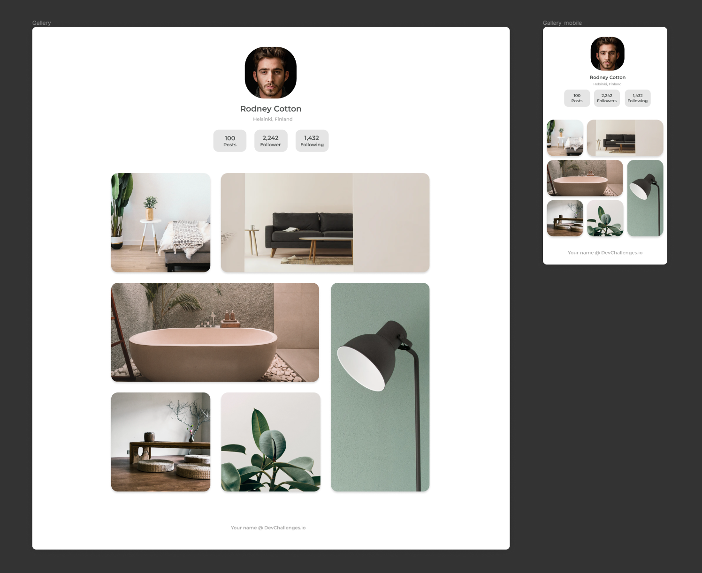

## MY GALLERY | DEV CHALLENGES

## Le Challenge

Voici ma solution au challenge : my gallery de Dev challenge.

## Démonstration

Lien vers le projet : https://aperbet56.github.io/my_gallery/

## Projet développé avec

- Utilisation des balises sémantiques HTML5
- CSS3
- Flexbox
- Grid
- Animations CSS (transition)
- Page web responsive
- Desktop first
- Utilisation d'un normaliseur : le fichier normalize.css
- Importation de la police "Montserrat"
